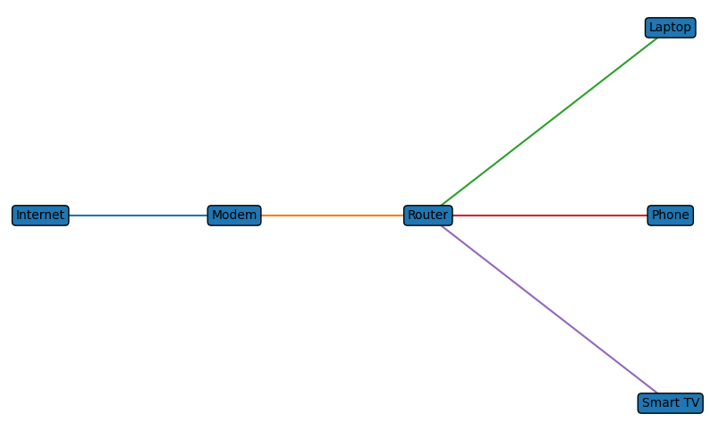

Lab 1 — Home Network Diagram
Author: Joy Townsend
Date: March 7, 2026

Objective

Create a basic home network diagram and explain how data flows between devices and the internet.

Network Diagram

Explanation

This diagram shows how devices in a home network connect to the internet. The internet connects to a modem provided by the Internet Service Provider. The modem connects to a router, which directs traffic between the internet and devices inside the home network.

Devices such as laptops, phones, and smart TVs connect to the router through Wi-Fi. When a device sends a request, such as opening a website, the request travels from the device to the router, then to the modem, and out to the internet.

The web server processes the request and sends the response back through the modem and router. The router then delivers the data to the correct device inside the network.
